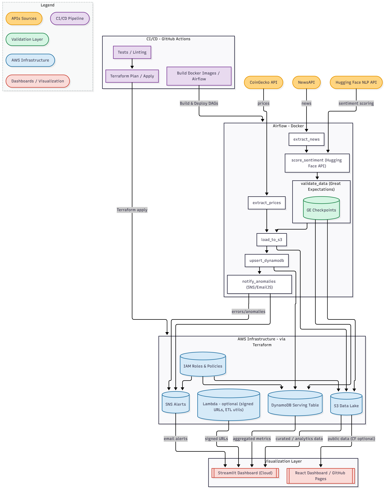

# 🚀 CryptoSentiment

> **Projet Data Engineering complet (end-to-end) démontrant la mise en œuvre d’une plateforme d’analyse de sentiments appliquée aux cryptomonnaies, entièrement automatisée et construite sur AWS Free Tier avec Airflow, Terraform et GitHub Actions.**.
---

**CryptoSentiment** est une plateforme d’analyse **100 % gratuite** qui combine :

- 📈 **Prix de cryptomonnaies** via [CoinGecko API]  
- 📰 **Actualités crypto** via [NewsAPI]  
- 💬 **Analyse de sentiment** via [Hugging Face Inference API]

Le projet illustre un **pipeline complet de Data Engineering** :  
collecte → validation → stockage → visualisation.

---

## 🎯 Objectif du projet

Construire une architecture **de bout en bout** pour automatiser :
1. La **collecte** de données crypto.
2. La **validation et transformation** avec Airflow + Great Expectations.
3. Le **stockage** sur AWS (S3, DynamoDB, SNS).
4. La **visualisation** via Streamlit Cloud ou React (GitHub Pages).

Le tout en **Free Tier** (AWS, Docker, GitHub Actions).

---

## 🧱 Architecture du projet

### 📦 Composants principaux

| Couche | Outil / Service | Rôle |
|--------|-----------------|------|
| **Orchestration** | Apache Airflow (Docker) | Gère les DAGs de collecte et d’analyse |
| **Infrastructure** | Terraform + AWS | Déploie S3, DynamoDB, SNS, IAM |
| **Validation** | Great Expectations | Vérifie la qualité des données |
| **CI/CD** | GitHub Actions (OIDC) | Déploiement sans clé, infra automatisée |
| **Visualisation** | Streamlit / React | Dashboard interactif sur données DynamoDB |

---
## 🧱 Stack Technique

| **Domaine** | **Technologie** | **Rôle** |
|--------------|-----------------|-----------|
| 🧩 **Infrastructure as Code** | Terraform | Provisionnement automatisé des ressources AWS (S3, DynamoDB, SNS, IAM) |
| ☁️ **Cloud Provider** | AWS Free Tier | Hébergement du Data Lake, des tables de serving et du système d’alertes |
| ⚙️ **Orchestration** | Apache Airflow (Docker Compose) | Ingestion, planification et automatisation des pipelines |
| ✅ **Data Quality** | Great Expectations | Validation des données et génération automatique de Data Docs |
| 💾 **Storage** | S3 (Data Lake) + DynamoDB (Serving) | Stockage brut, transformé et indexation des résultats de sentiment |
| 🔔 **Monitoring / Alerting** | AWS SNS + EmailJS | Notifications automatiques sur erreurs ou anomalies détectées |
| 🔐 **CI/CD** | GitHub Actions (OIDC) | Déploiement sans clés AWS, intégration et mise à jour automatisées |
| 🧠 **APIs Sources** | CoinGecko, NewsAPI, Hugging Face | Collecte des prix crypto, actualités et analyse de sentiment NLP |
| 💻 **Front-end / Dashboard** | Streamlit Cloud ou React + GitHub Pages | Visualisation des indicateurs et tendances crypto |
| 🐧 **Environnement** | Docker + WSL2 + Windows 11 | Exécution locale reproductible et isolée |

---

## ⚙️ Pipeline de données (Airflow)

### Étapes principales :

1. **Fetch Prices** – Récupération des prix crypto depuis CoinGecko → `S3/raw/prices/`  
2. **Fetch News** – Extraction des actualités crypto → `S3/raw/news/`  
3. **Validate Data** – Contrôle de qualité via Great Expectations → `S3/validation/`  
4. **Analyze Sentiment** – Analyse NLP via Hugging Face → `DynamoDB/timeseries`  
5. **Notify Alerts** – Notifications via SNS / EmailJS en cas d’anomalie  

---

## ☁️ Infrastructure AWS

Déployée automatiquement avec **Terraform** :

| Service | Ressource créée | Détails |
|----------|-----------------|----------|
| **S3** | `cryptosentiment-dev-...-datalake` | Données brutes et validées |
| **DynamoDB** | `cryptosentiment-dev-timeseries` | Stockage des scores de sentiment |
| **SNS** | `cryptosentiment-dev-alerts` | Alertes automatiques |
| **IAM** | 3 utilisateurs : Terraform, Airflow, GitHub Actions (OIDC) | Principe du moindre privilège |

---

## 🔁 CI/CD (GitHub Actions)

Pipeline automatisé sur chaque push `main` :
1. **Terraform Plan & Apply** → provisionne ou met à jour l’infra AWS.  
2. **Linting / Tests (à venir)** → vérifie les DAGs et scripts Python.  
3. **Déploiement Airflow (à venir)** → build + push des DAGs.

> ✅ Authentification OIDC → aucune clé AWS stockée dans GitHub.

---

## 🧩 Stack Technique

| Domaine | Outil / Technologie |
|----------|--------------------|
| Orchestration | Apache Airflow (Docker Compose) |
| Cloud | AWS Free Tier (S3, DynamoDB, SNS, IAM) |
| IaC | Terraform |
| CI/CD | GitHub Actions (OIDC) |
| Validation | Great Expectations |
| Dashboard | Streamlit / React |
| Langage | Python 3.11 |
| Environnement | Windows 11 + Docker Desktop (WSL2) |

---

## 🧠 Prochaines étapes

- [ ] Créer les DAGs Airflow (`fetch_prices`, `fetch_news`, `analyze_sentiment`)  
- [ ] Intégrer Great Expectations pour validation automatique  
- [ ] Ajouter l’alerte SNS / EmailJS sur erreurs  
- [ ] Développer le dashboard (Streamlit / React)  
- [ ] Ajouter des tests et lint Python dans CI/CD  

---

## 📚 Compétences démontrées

- Terraform (S3, DynamoDB, IAM, SNS, backend distant S3+DDB lock)
- CI/CD avec GitHub Actions + OIDC (authentification sans clé)
- Architecture DataOps complète sur AWS Free Tier
- Airflow orchestration & data pipeline design
- Sécurité et principe du moindre privilège IAM

---

## 🤝 Auteur

Projet réalisé par **MAAOUIA Ahmed**  
Étudiant en Data Engineering / Cloud & DevOps  
📍 Région : France / Paris  
📧 [LinkedIn]([https://www.linkedin.com/in/ahmed-maaouia/])

---

## 🧰 Stack Icons

  
  
  
  
  
  
  

> “From ingestion to visualization — automating every step of the DataOps lifecycle.”
